# PoSoccer — ML-Agents Architecture Diagram Suite

Generated **2026-08-05** against `master` @ `5f25701`.
Project: top-down 2D physics soccer. Unity 6000.5.6f1, 2D URP, **Box2D** (`Physics2D`).

**Read this before the diagrams.** Two facts shape every one of them:

1. **No joints, no articulated rig, no PhysX.** Each agent is a *single* `Rigidbody2D`
   driven by one linear force and one torque (`Agent_Soccer.OnActionReceived`). There are
   no per-joint drive targets, no $K_p$/$K_d$ gains, no DoF chain. This is a recorded
   deviation — see `rules-exemptions.md` §2. The "Actuator Map" below therefore documents
   the **traction model**, which is what actually converts action vectors into motion.
2. **No trained brain is currently assigned.** All four personality `.onnx` were deleted
   on 2026-08-05 (they declared 102 inputs against a 118-input runtime). `brainModel` is
   `null` on all five profiles, so every player falls back to `Agent_HeuristicBot`. The
   inference path below is *the contract*, not something running today.

Total model inputs: **118** = 66 ray + 52 vector. Changing any of it obsoletes every export.

---

## 1. Runtime Inference Loop

### 1-simple

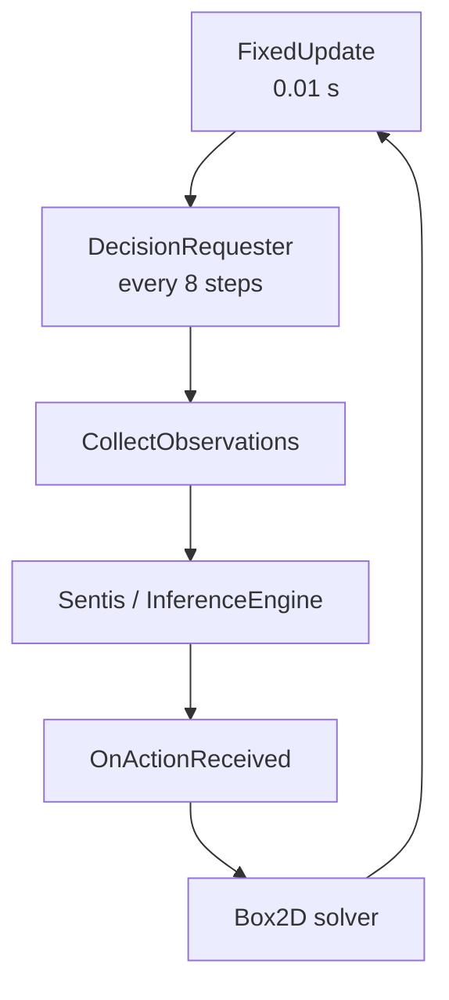

### 1-detailed

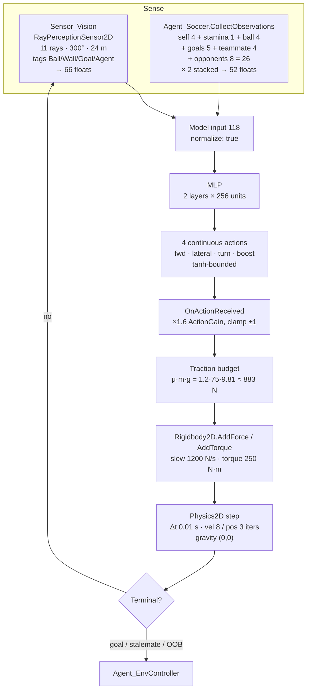

> `RayPerceptionSensor.OutputSize()` = `(DetectableTags + 2) × (2 × RaysPerDirection + 1)`
> = `(4 + 2) × 11` = **66**. It depends on tag and ray *counts* only — **not** on arc or
> range. Changing `ArcDegrees` or `RayLength` keeps every tensor shape identical while
> silently changing what the rays mean. See the sensor-geometry landmine in `CLAUDE.md`.

---

## 2. Tensor Blueprint

### 2-simple

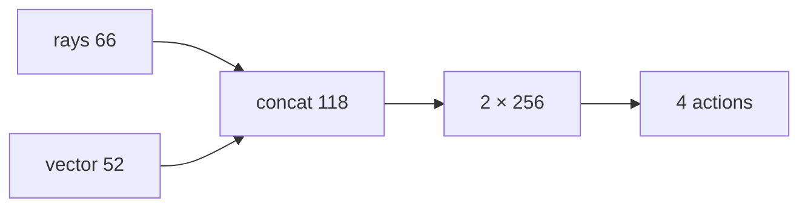

### 2-detailed

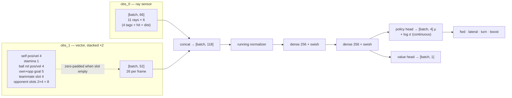

**Zero-padding is load-bearing.** Training and eval are **1v1** — `SCN_Training` holds
exactly two agents — so the teammate block and the second opponent slot are *always zero*.
No policy has ever practised with a teammate; 2v2 is untested capability, not tuned
behaviour.

---

## 3. Reward Tree

### 3-simple

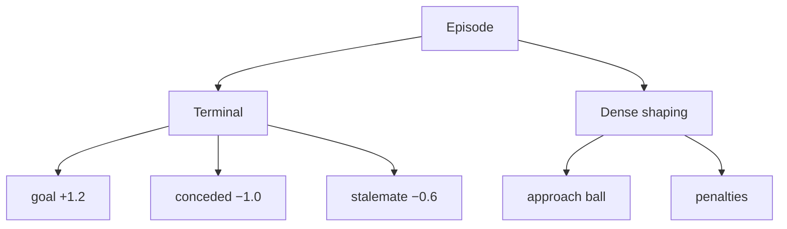

### 3-detailed

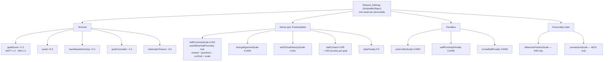

**Why the terminal numbers are what they are.** The original table
(`goalScorer 0.7 / stalemateTimeout −0.1`) made stalling *optimal*: EV(stall) = −0.1 vs
EV(attack at 50/50) = −0.15, so a policy needed a **>53% win rate before attacking beat
parking the bus** — and it wins ~17%. Retuned 2026-08-04 so attacking wins even at 30%
(−0.34 vs −0.60).

**Personality lives in terminal rewards, trait scales and physique — never in the
locomotion mechanics.** `RewardProfiles_MatchCodeDefaultsOnMechanics` (EditMode) pins the
mechanics terms to the code defaults after profile drift cost four training runs. Keep it
green.

---

## 4. Actuator Map

> **There are no joints.** The rule this diagram answers asks for joint drive targets,
> $K_p$/$K_d$ and DoF limits. PoSoccer has none — one `Rigidbody2D`, one force, one torque.
> What follows is the real actuation chain: a friction-circle traction model.

### 4-simple

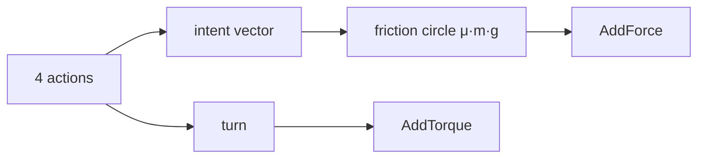

### 4-detailed

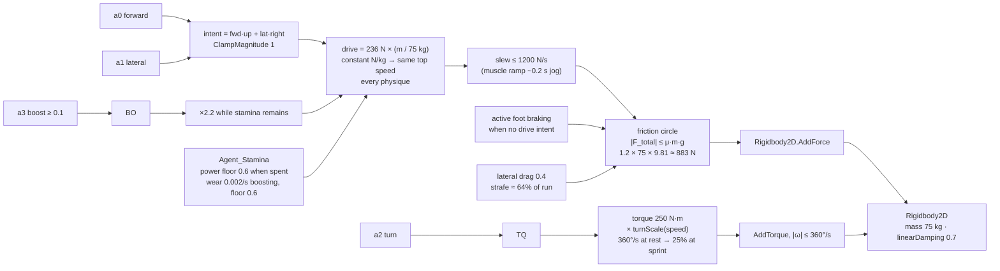

Measured on the chassis: **4.35 m/s jog, 9.54 m/s sprint, t95 ≈ 3.7 s.** Gravity is
`(0,0)` in-plane (top-down; `rules-exemptions.md` §1) but $g = 9.81$ enters *physically*
through the traction budget — body weight sets the normal force, which sets how hard the
feet can push, cut and brake.

Ball: FIFA spec — r = 0.11 m, 0.43 kg, drag ~0.1 randomized per episode, Magnus curl.
Wall kick-out: 6 N·s impulse inside a 1.0 m band, 0.5 s cooldown (corner-scrum escape).

---

## 5. Hyperparameter Matrix

### 5-simple

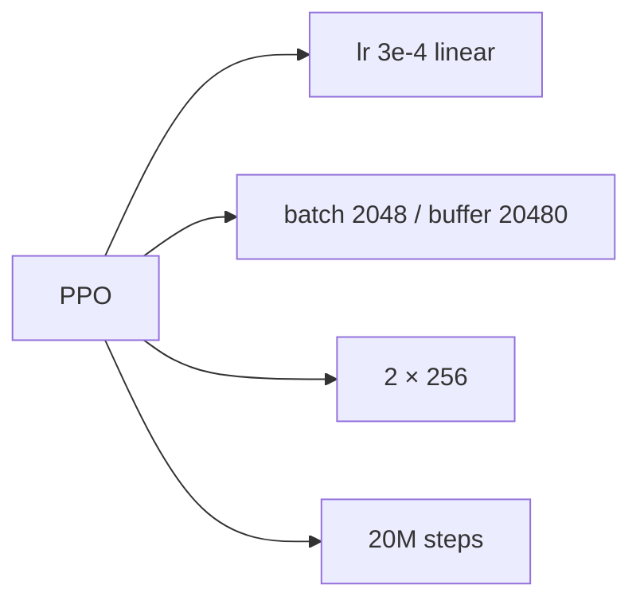

### 5-detailed

```mermaid
flowchart LR
    subgraph trainer["trainer — config/STANDARD_phase9_randomized.yaml"]
      T1["trainer_type: ppo"]
      T2["max_steps: 20,000,000"]
      T3["time_horizon: 1024"]
      T4["summary_freq: 50,000"]
      T5["keep_checkpoints: 20<br/>checkpoint_interval: 1,000,000"]
    end
    subgraph hyper["hyperparameters"]
      H1["batch_size: 2048"]
      H2["buffer_size: 20480"]
      H3["learning_rate: 3.0e-4<br/>schedule: linear"]
      H4["beta: 8.0e-3"]
      H5["epsilon: 0.2"]
      H6["lambd: 0.95"]
      H7["num_epoch: 3"]
    end
    subgraph net["network_settings"]
      N1["normalize: true"]
      N2["hidden_units: 256"]
      N3["num_layers: 2"]
    end
    subgraph rs["reward_signals"]
      R1["extrinsic<br/>gamma 0.99 · strength 1.0"]
    end
    subgraph env["environment_parameters"]
      E1["goal_width: 6.0 (fixed —<br/>matches eval, no mismatch)"]
      E2["bot_strength: uniform<br/>[0.2, 1.0] per episode"]
    end
    trainer --> hyper --> net --> rs --> env
```

**Phase 9 is a single-variable change: the curriculum was replaced by sampling.** A gated
ladder starved every prior run — p7 spent all 20M steps at `bot_strength` 0.2 and was then
graded at 1.0. Coverage went *backwards* across runs (p5 → 0.8, p6 → 0.5, p7 → 0.2,
p8 → 0.35). Uniform sampling makes the train and eval distributions match and leaves no
threshold to tune wrong.

Parity is enforced: embedded `com.unity.ml-agents` **4.1.0** ↔ Python `mlagents`
**1.2.0.dev0**, pinned in `requirements-training.txt`.

---

## 6. Episode Lifecycle

### 6-simple

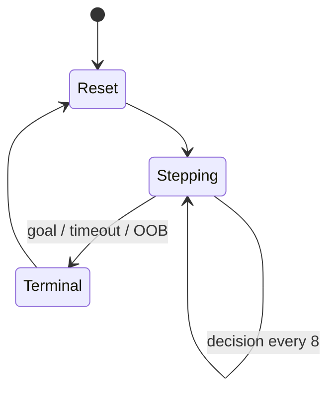

### 6-detailed

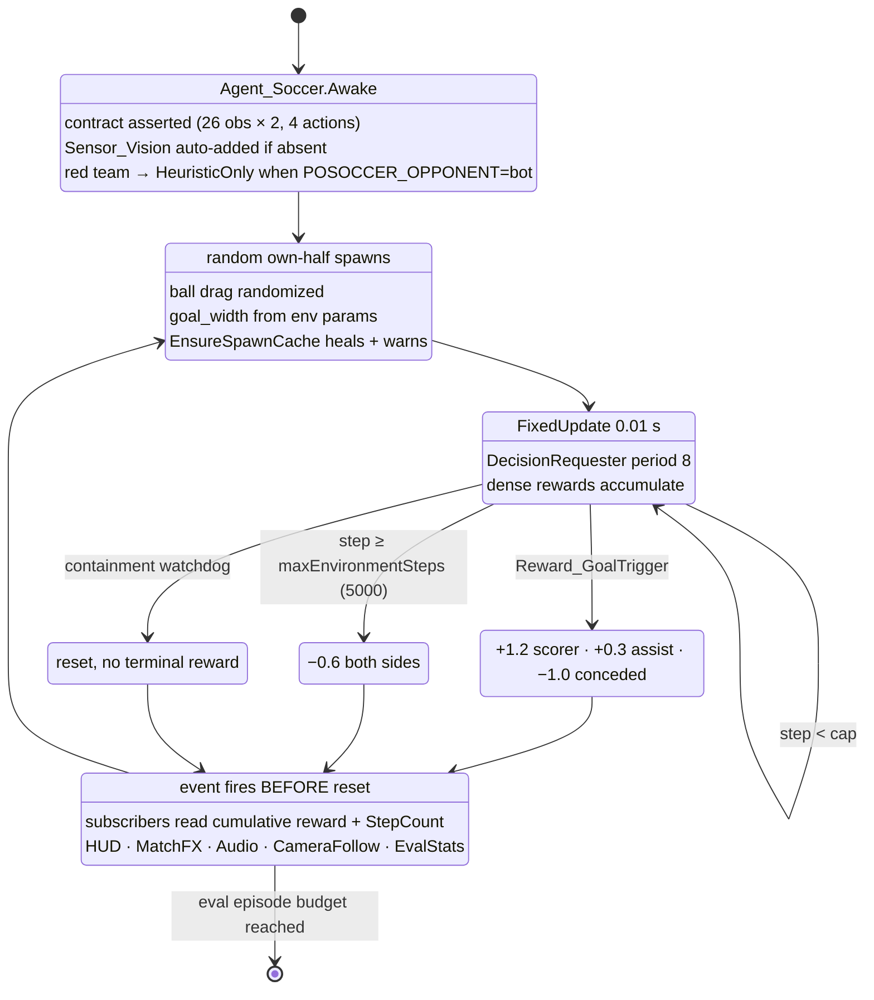

**The event ordering is a contract.** `EpisodeEnded` fires *before* `ResetPitch` so
subscribers can still sample `GetCumulativeReward()` and `StepCount`. Five components
depend on it, each with a matched `+=`/`-=` in enable/disable. Moving the fire site after
the reset would silently zero every reported reward.

`stepCapOverride` on the exhibition Pitch shortens episodes to 2500 steps for match pace;
training uses the full 5000.
