# PoSoccer — ML-Agents Architecture Diagram Suite

Generated 2026-07-31 against commit `521293c` (+ bot boost-shot/shoulder-charge working tree).
Project: top-down 2D physics soccer (Unity 6000.5.4f1, 2D URP, **Box2D** physics — this
project has no 3D PhysX, no joints, no articulated rigs; agents are momentum-driven boxes).
Note: the generation template referenced `CreatureTrainingRace.unity`; this project's
training scene is `Assets/Scenes/SCN_Training.unity` — all diagrams reflect the real scene.

Brains: `STANDARD` (trained), `MATT` / `KIM` / `NICK` (reward-DNA designed, untrained — bot-driven).

---

## 1. Runtime Inference Loop

### 1-simple
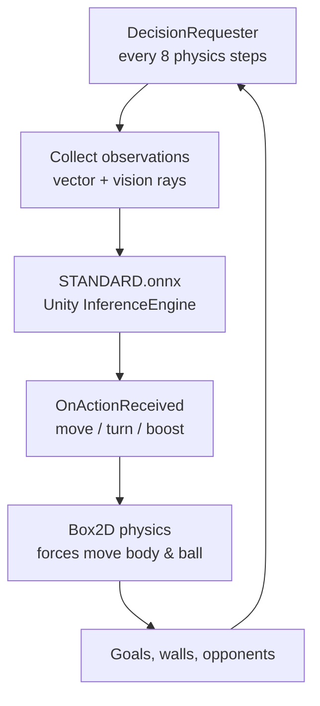

### 1-detailed
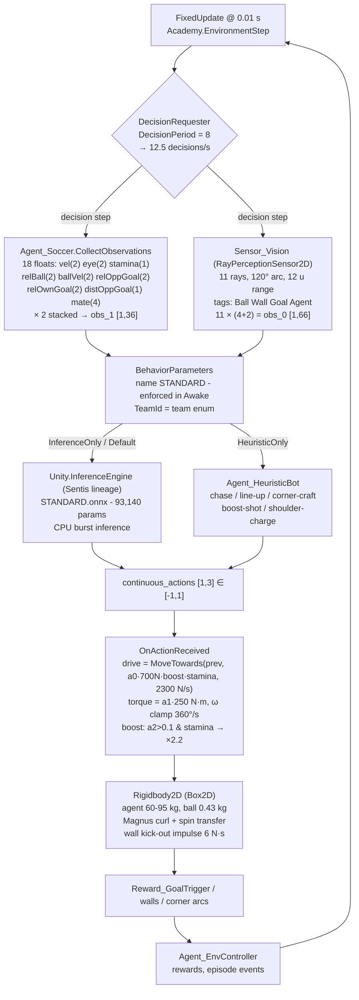

---

## 2. Tensor Blueprint

### 2-simple
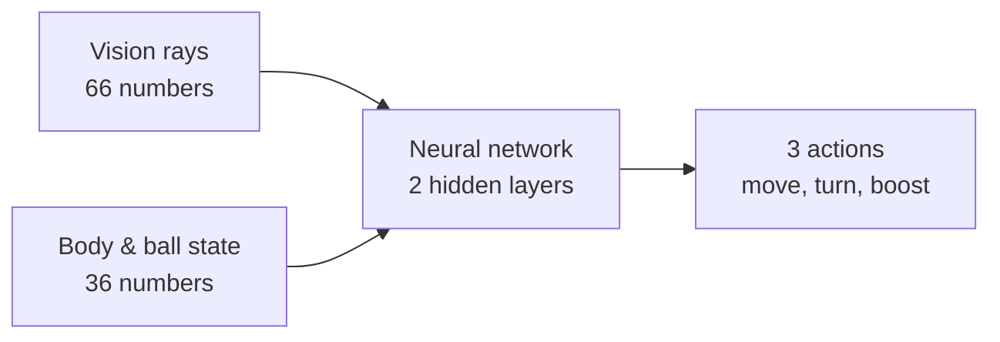

### 2-detailed
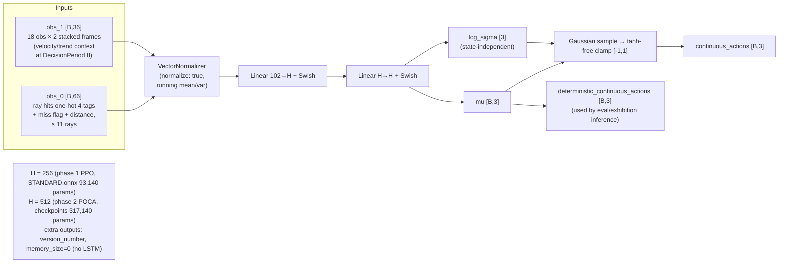

---

## 3. Reward Tree (per-brain personality DNA in `Reward_Settings` assets)

### 3-simple
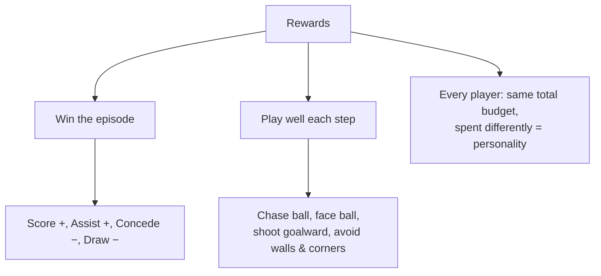

### 3-detailed
```mermaid
graph TD
    ROOT[Reward stream] --> TERM["Terminal (episode end)\nbudget: Σ = 2.2 for every player"]
    ROOT --> DENSE["Dense (per decision)\nbudget: Σ scales = 0.0016"]
    ROOT --> SPARSE["Sparse"]
    ROOT --> GROUP["MA-POCA group (2v2)\nwin +1 / lose −1 team reward"]
    TERM --> TS["goalScorer: STD 0.7, MATT 1.0,\nKIM 0.45, NICK 0.5"]
    TERM --> TA["assist: STD 0.3, MATT 0.15,\nKIM 0.35, NICK 0.5"]
    TERM --> TB["teamBaselineVictory: 0.15–0.2"]
    TERM --> TC["goalConceded: STD −1.0, MATT −0.9,\nKIM −1.2, NICK −1.0"]
    TERM --> TD2["stalemateTimeout: MATT −0.2 … KIM −0.02"]
    DENSE --> D1["ballProximity 1/(1+d) × 0.0002–0.0004"]
    DENSE --> D2["facingAlignment dot(eye,toBall) × 0.0002"]
    DENSE --> D3["ballToGoalVelocity (the shoot gradient)\nSTD 0.0010, MATT 0.0011, KIM/NICK 0.0004–6"]
    DENSE --> D4["KIM trait: defensivePosition 0.0006\n(stand on ball→own-goal line)"]
    DENSE --> D5["NICK trait: possession 0.0006\n(ball within 1.2 m)"]
    DENSE --> PEN["Penalties (style, off-budget):\nstep −0.0001/−0.0002, jitter ×0.0005–0.002,\nwall band −0.0005, corner zone −0.0006"]
    SPARSE --> S1["first ballContact +0.05/episode"]
```

---

## 4. Actuator Map (no joints/Kp-Kd — force-driven rigid bodies)

### 4-simple
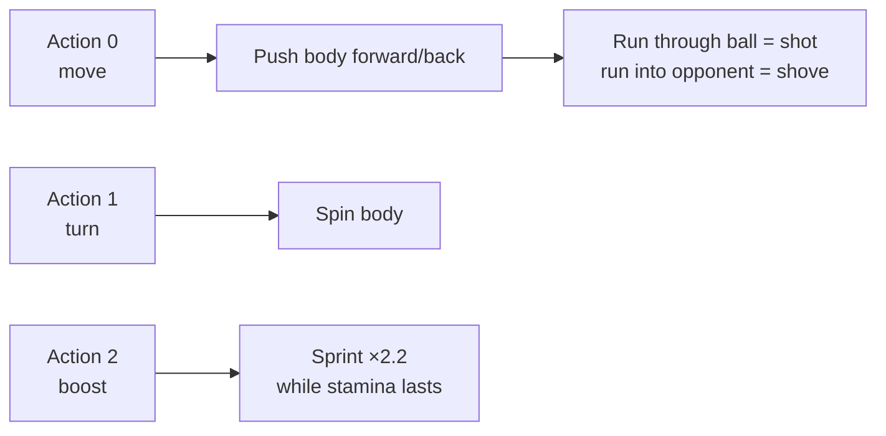

### 4-detailed
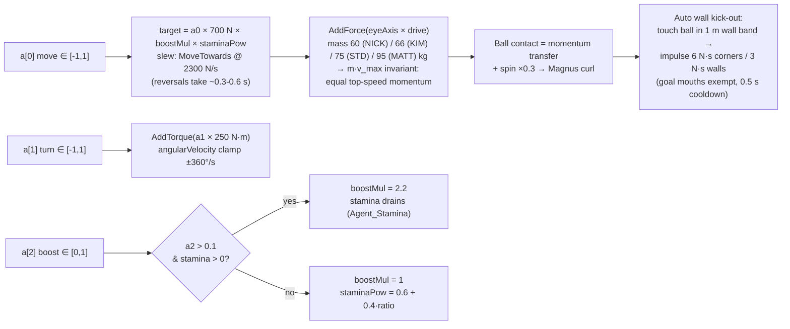

---

## 5. Hyperparameter Matrix

### 5-simple
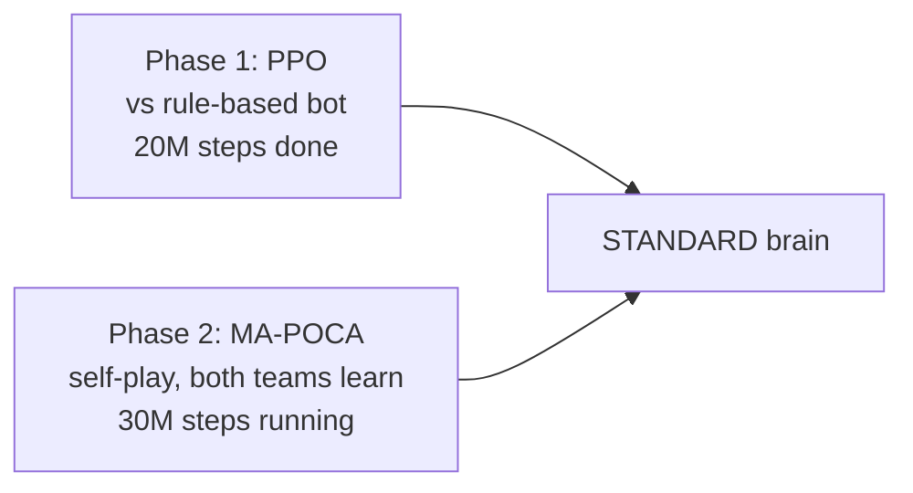

### 5-detailed
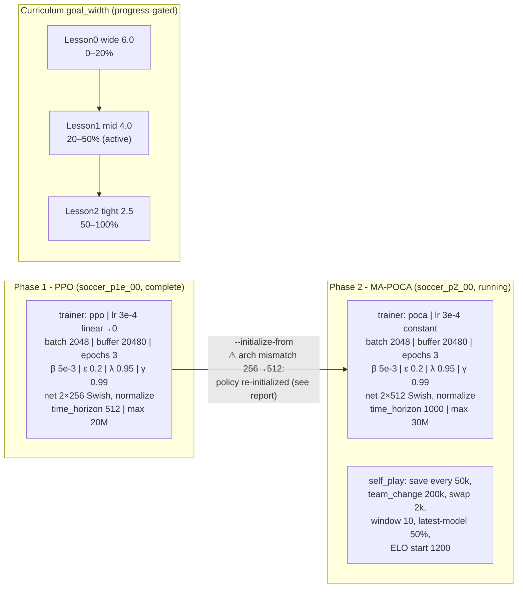

---

## 6. Episode Lifecycle

### 6-simple
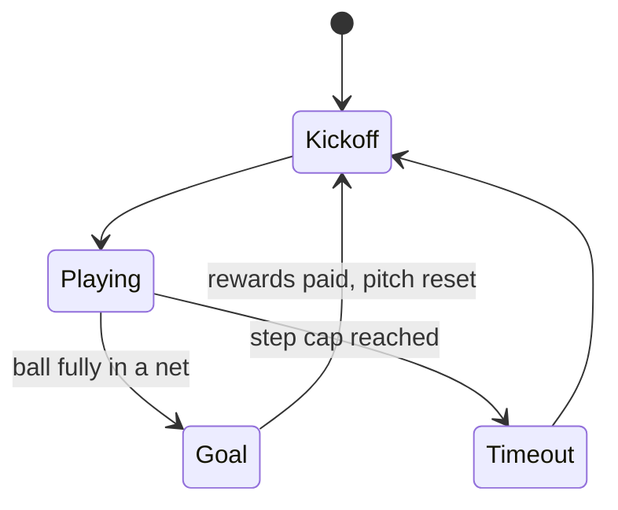

### 6-detailed
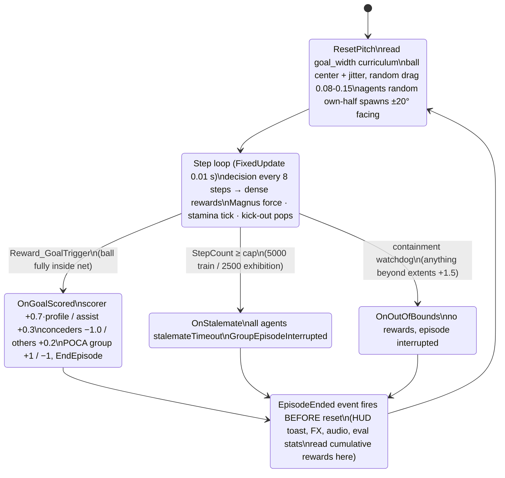
